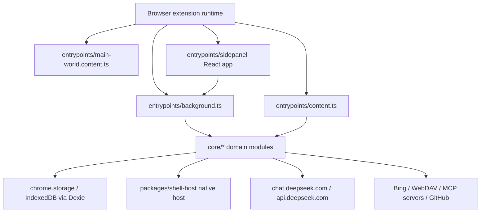

# Project Overview

## Preliminary Direction

为 DeepSeek++ 增加多语言支持，第一阶段先支持英文版本。当前目标应覆盖插件本体的用户可见文案，并为后续更多语言留下单一、可测试、可替换的 i18n 端口。

## Current Architecture

DeepSeek++ 是 WXT + React + TypeScript 的 MV3 浏览器扩展。后台 service worker 负责存储、工具执行、MCP、自动化、导出、右键菜单和 sidepanel 消息路由；content script 注入 DeepSeek 页面，负责导出按钮、工具结果渲染、Agent 续跑展示和悬浮宠物；sidepanel 是主要管理 UI，包含对话、记忆、能力、预设、自动化和设置页面。

当前没有 `_locales/`、`messages.json`、`chrome.i18n`、React i18n context 或统一文案模块。中文文案散落在 `entrypoints/sidepanel/**`、`entrypoints/content.ts`、`entrypoints/background.ts`、`core/tool/**`、`core/pet/lines.ts`、`core/skill/builtin.ts` 和 smoke 脚本中。已有 `README_EN.md` 只是公开文档英文版，不构成插件运行时多语言支持。

## Technology Stack

| Layer | Current | Target |
|:--|:--|:--|
| Language | TypeScript, JavaScript ESM | TypeScript with typed i18n resources |
| Framework | WXT, React 19, Tailwind CSS 4 | Same |
| Build Tool | WXT / Vite / tsc | Same, plus locale asset inclusion |
| Package Manager | npm workspaces | Same |
| Database | Dexie / IndexedDB plus `chrome.storage` | Same; optional locale preference in `chrome.storage` |
| Deployment | Chrome / Edge / Firefox MV3 builds | Same, with browser manifest locale support where applicable |

## Entry Points

- `entrypoints/background.ts`: background service worker, message router, context menus, automation alarm, export orchestration, chat/tool loops.
- `entrypoints/content.ts`: DeepSeek page integration, export menu/toast, inline tool blocks, Agent step UI, token speed, pet UI.
- `entrypoints/main-world.content.ts`: page-context bridge for DeepSeek requests.
- `entrypoints/sidepanel/App.tsx`: React sidepanel shell and tabs.
- `entrypoints/sidepanel/pages/*.tsx`: user-facing settings and feature pages.
- `core/tool/runtime.ts`: tool descriptor and execution registry.
- `core/prompt/augmentation.ts` and `core/inline-agent/prompt.ts`: model-facing prompt text.
- `wxt.config.ts`: manifest generation and target browser settings.
- `packages/shell-host/*`: native messaging host and npm installer.

## Build & Run

- Development: `npm run dev`
- Type check: `npm run compile`
- Unit tests: `npm test`
- Browser builds: `npm run build:chrome`, `npm run build:edge`, `npm run build:firefox`
- Full release gate: `npm run ci:quality`

## Testing Baseline

Vitest is configured for `tests/**/*.test.ts` in `jsdom`. Existing tests cover conversation export, official API, inline markdown, MCP transport common logic, memory tool behavior, request augmentation, shell policy, and sync schema. There is no current i18n test harness, no text coverage audit, and no sidepanel rendering snapshot focused on locale switching.

For English support, the reliable first test layer should be pure unit tests for locale resolution and translator behavior, followed by targeted tests for resource completeness. UI smoke can be added after the i18n provider is wired into the sidepanel/content surfaces.

## Project Governance Baseline

- Shared instruction surface: `AGENTS.md`, auto-synced from Claude project memory. It is canonical for shared repo guidance.
- Claude Code instruction surface: no root `CLAUDE.md` in this repository. `.claude/settings.local.json` exists, plus `.claude/worktrees/`.
- Codex/project skill surface: `.codex/skills/` exists but currently has no files.
- Native memory surface: Codex memory is available outside the repo and contains prior DeepSeek++ conventions; it should remain the durable memory surface. No repo-local fallback memory should be created unless explicitly selected.
- Progress surface: no active `docs/progress/MASTER.md`; this is a fresh spec-driven task.
- Current worktree note: `audit-report-deepseek-pp-2026-06-05.html` is already deleted before this run and is unrelated to i18n. Do not revert it as part of this task.

## External Integrations

- DeepSeek web and official API: `chat.deepseek.com`, `api.deepseek.com`
- Browser APIs: `chrome.storage`, `chrome.runtime`, `chrome.contextMenus`, `chrome.sidePanel`, `chrome.permissions`, `chrome.alarms`, `chrome.tabs`
- MCP transports: HTTP, SSE, Streamable HTTP, stdio bridge, native messaging
- Native host: `packages/shell-host`
- WebDAV sync
- GitHub Skill import API
- Bing search/fetch permissions

## GitHub Tracking Pre-flight

Detected mode: `GITHUB_STANDARD`.

`gh` is installed and authenticated, repository access works for `zhu1090093659/deepseek-pp`, and Issues are available. GitHub Projects access is not available in the current auth scope, so this run can create Issues and Milestones after confirmation, but not a Project board unless auth is refreshed with project scope.
