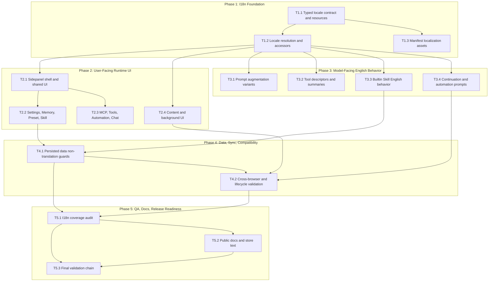

# Task Dependency Graph

```mermaid
graph TD
  subgraph P1 ["Phase 1: I18n Foundation"]
    T1_1["T1.1 Typed locale contract and resources"]
    T1_2["T1.2 Locale resolution and accessors"]
    T1_3["T1.3 Manifest localization assets"]
    T1_1 --> T1_2
    T1_1 --> T1_3
  end

  subgraph P2 ["Phase 2: User-Facing Runtime UI"]
    T2_1["T2.1 Sidepanel shell and shared UI"]
    T2_2["T2.2 Settings, Memory, Preset, Skill"]
    T2_3["T2.3 MCP, Tools, Automation, Chat"]
    T2_4["T2.4 Content and background UI"]
    T2_1 --> T2_2
    T2_1 --> T2_3
  end

  subgraph P3 ["Phase 3: Model-Facing English Behavior"]
    T3_1["T3.1 Prompt augmentation variants"]
    T3_2["T3.2 Tool descriptors and summaries"]
    T3_3["T3.3 Builtin Skill English behavior"]
    T3_4["T3.4 Continuation and automation prompts"]
  end

  subgraph P4 ["Phase 4: Data, Sync, Compatibility"]
    T4_1["T4.1 Persisted data non-translation guards"]
    T4_2["T4.2 Cross-browser and lifecycle validation"]
    T4_1 --> T4_2
  end

  subgraph P5 ["Phase 5: QA, Docs, Release Readiness"]
    T5_1["T5.1 I18n coverage audit"]
    T5_2["T5.2 Public docs and store text"]
    T5_3["T5.3 Final validation chain"]
    T5_1 --> T5_2
    T5_1 --> T5_3
    T5_2 --> T5_3
  end

  T1_2 --> T2_1
  T1_2 --> T2_4
  T1_2 --> T3_1
  T1_2 --> T3_2
  T1_2 --> T3_3
  T1_2 --> T3_4
  T2_2 --> T4_1
  T3_3 --> T4_1
  T2_4 --> T4_2
  T3_4 --> T4_2
  T4_1 --> T5_1
  T4_2 --> T5_1
```
